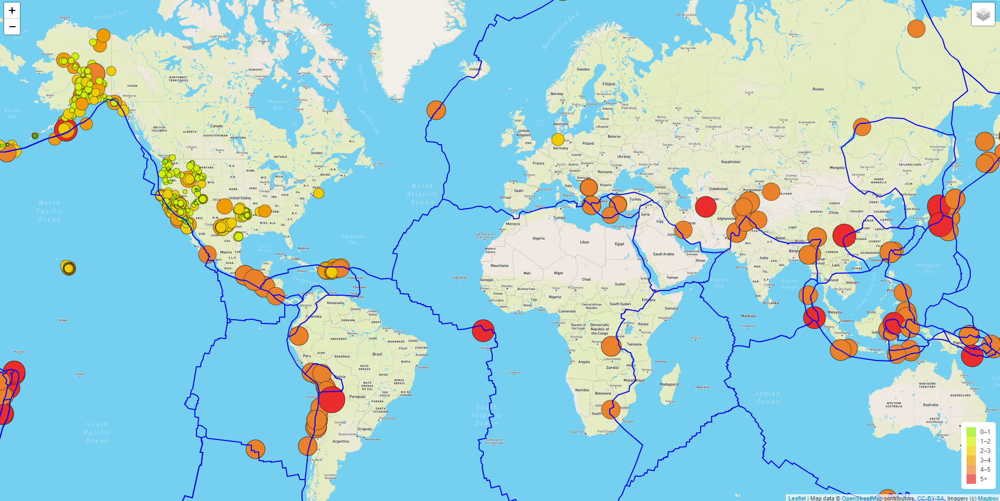
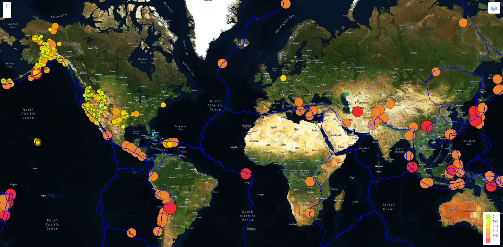
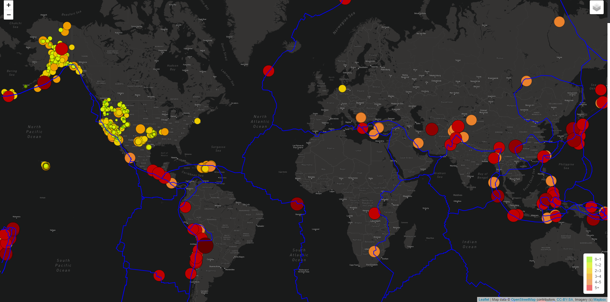

# Mapping Earthquakes
Module 13 Bootcamp: ***Leaflet.js***
## Overview
The purpose of this analysis is to visually display the differences between the magnitudes of earthquakes all over the world for the last seven days.

## Resources
- **Data Source:** 
  - <code>https://earthquake.usgs.gov/earthquakes/feed/v1.0/summary/4.5_week.geojson</code>
  - <code>https://earthquake.usgs.gov/earthquakes/feed/v1.0/summary/all_week.geojson</code>
  - <code>https://raw.githubusercontent.com/fraxen/tectonicplates/master/GeoJSON/PB2002_boundaries.json</code>
- **Software:** 
  - Python 3.9.5
  - Visual Studio Code 1.58.0
  - JavaScript
  - D3.js library
  - Leaflet.js
  - Mapbox API (GeoJson)

## Results
Development of an interective map with options to visualize it with three different styles: **Satellite**, **Street** and **Dark**.

The map has three different layers: **Earthquakes**, **Tectonic Plates** and **Major EQ**.

### Street Map View
 

### Satellite Map View
 

### Dark Map View
 

## Link to the map
<code>https://izhakfc.github.io/Mapping_Earthquakes/</code>
